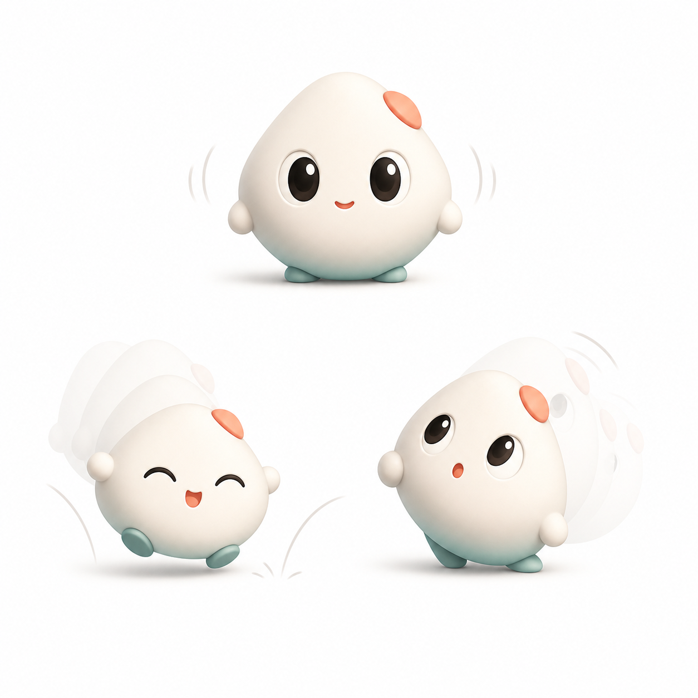
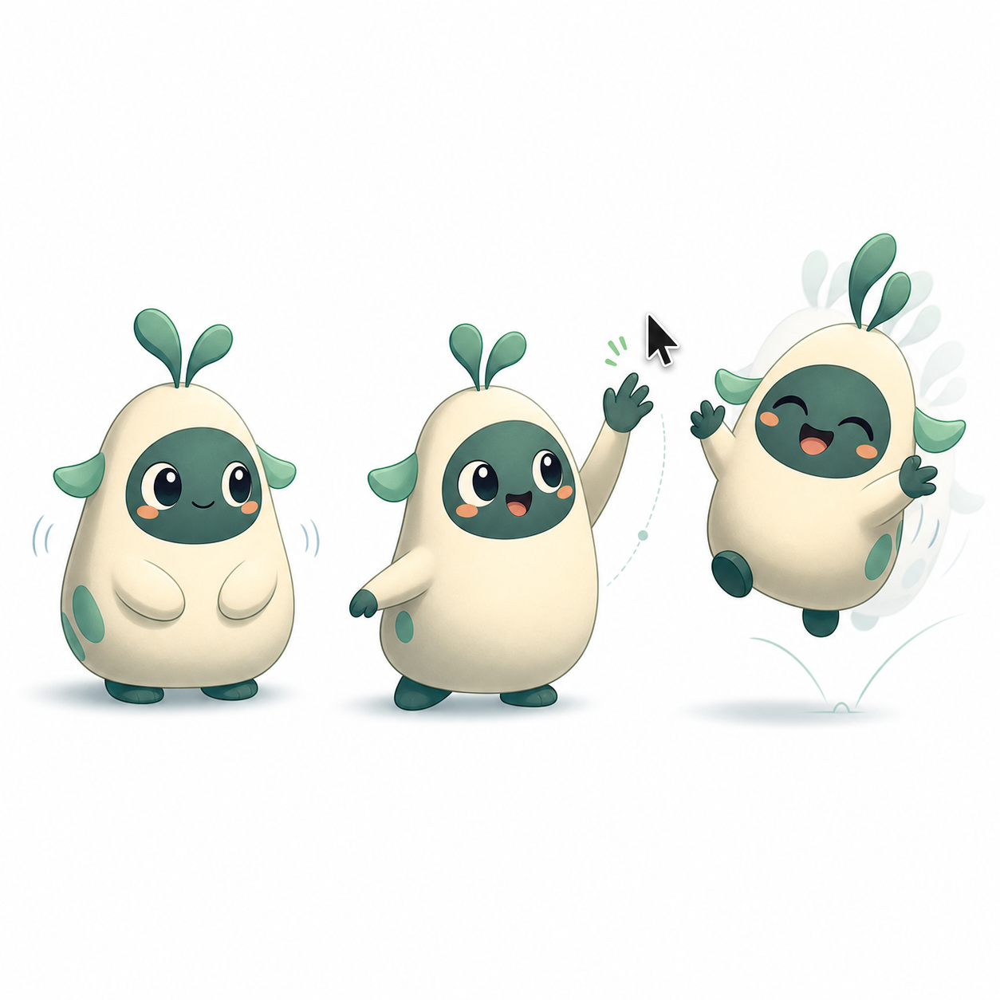
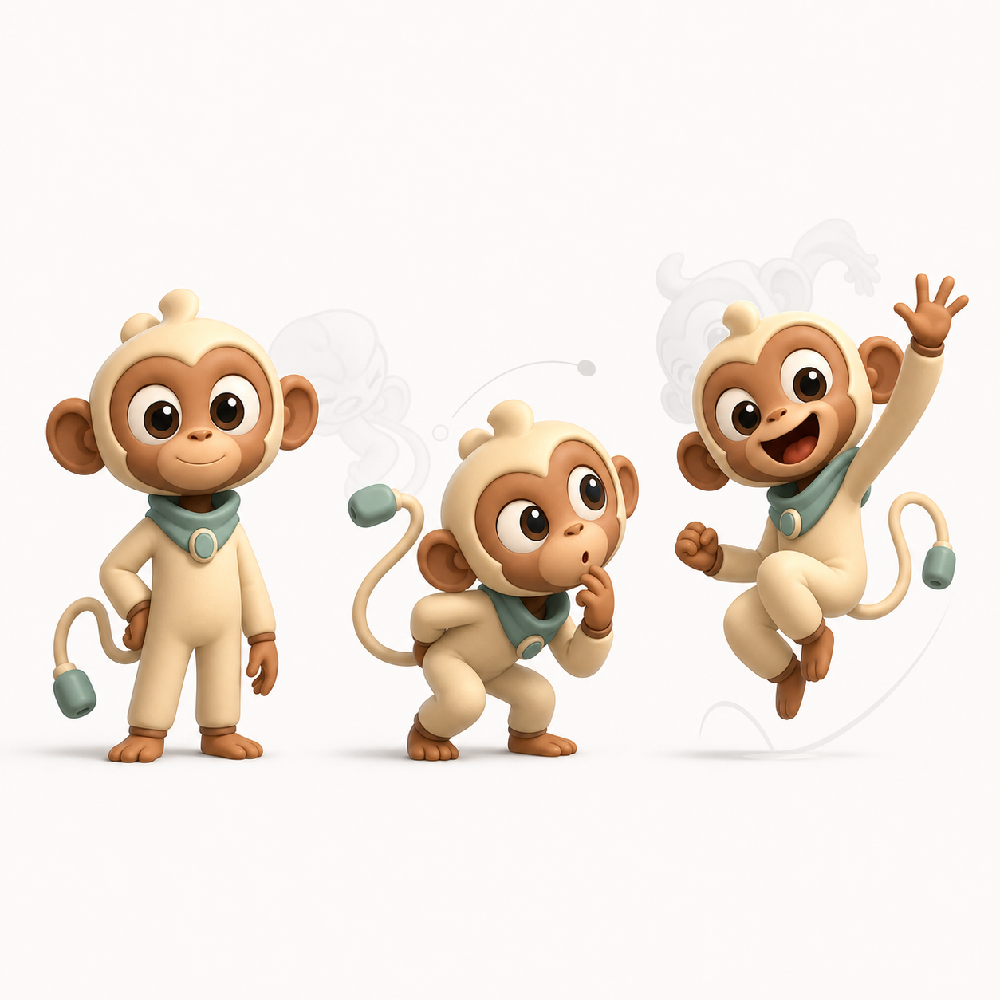
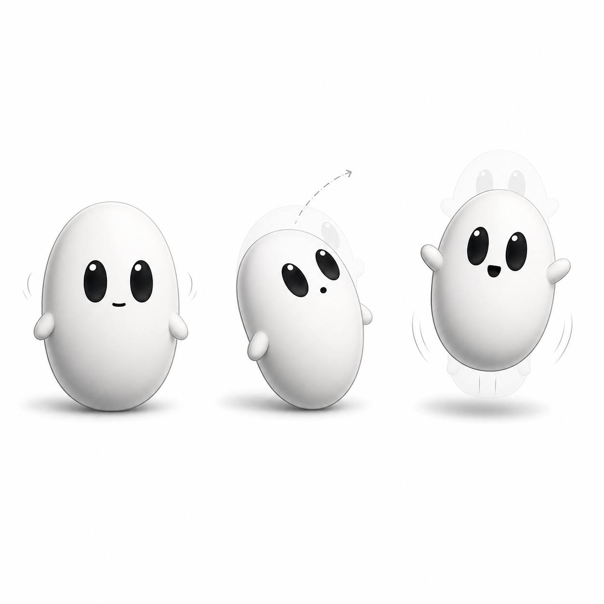

# Stickman Redesign Directions

Generated on 2026-05-19 as first-pass visual directions for replacing Stickman's current animation/design.

## Direction 1: Geometric Pebble

The simplest route: a soft rounded pebble/squircle with large eyes, tiny hands, tiny feet, and one small color accent. This is the easiest direction to animate in the current AppKit renderer because it can be mostly procedural: body path, eyes, pupils, mouth, nubs, and a few highlights.

Best animation fits:
- Idle breathing and squash/stretch.
- Mouse-following pupils.
- Blink, hop, lean, wobble, and sleep.
- Lightweight walk/slide where feet barely need to articulate.

Tradeoff: very charming at small size, but limited acting range. It will need excellent timing and facial states to feel alive instead of just cute.

## Direction 2: Layered Creature

The middle path: a small creature with a pear body, face mask, ear/leaf tufts, arms, feet, and accent spots. This keeps Stickman readable at `160 x 160`, but gives the silhouette and limb motion more personality.

Best animation fits:
- Existing jump, bob, blink, and eye tracking.
- Waving/reaching toward the cursor.
- Ear/tuft secondary motion.
- Chat/listening poses using face and arm variants.
- Layered PNG or procedural hybrid rendering.

Tradeoff: more expressive than the pebble, still implementable without a full rig. This is probably the best balance if Stickman should feel like a companion while staying lightweight.

## Direction 3: Humanoid Monkey-Like Companion

The high-expression route: a small monkey-like humanoid with a big head, long arms, hands, feet, ears, face mask, scarf/accent, and full-body acting poses. This has the most emotional range and could make Stickman feel like a real desktop character.

Best animation fits:
- Pointing, waving, peeking, crouching, celebrating, shrugging.
- Rich idle state changes: curious, thinking, listening, excited, sleepy.
- Full pose library or rigged sprite/animation system.
- Stronger attachment and storytelling.

Tradeoff: highest cost by far. Hands, face, tail/cable, body poses, and silhouette changes are hard to make feel good with the current procedural renderer. This direction likely wants a proper layered rig or Rive/Lottie-style runtime before implementation.

## Implementation Notes

Stickman currently renders in `Sources/BuddyView.swift` as native AppKit drawing inside a `160 x 160` `NSView`. The safest production path is:

1. Pick a direction.
2. Turn it into a 160 px transparent character sheet with separate idle, blink, jump, walk, reach, and chat/listening states.
3. Either redraw it procedurally in AppKit, or revive the existing layered PNG pipeline under `Resources/StickmanAssets` and `Resources/stickman-layout.json`.

My recommendation: use Direction 2 if the goal is a noticeable upgrade without rebuilding the animation stack. Use Direction 1 if performance and implementation speed matter most. Use Direction 3 only if Stickman should become a major character system.

## Direction 2 Refined: Modern Oval Stickman

Refined on 2026-05-20 after choosing Direction 2 as the base. This version removes the top sprout, feet, color accents, and creature details. The new direction is a cleaner black-and-white oval body with side stubs, large black eyes, and a tiny mouth.

This is the strongest implementation target so far because it keeps the emotional read of Direction 2 while moving closer to Stickman's current modern/simple identity. It can be animated with only a few procedural parts:

- Oval body with squash, stretch, lean, and hop.
- Two side stubs with small rotation/reach.
- Two eyes with blink, gaze tracking, surprise scale, and smile compression.
- One tiny mouth path with neutral, happy, thinking, and surprised variants.
- One soft shadow that reacts to jump height.

My current production recommendation is to implement this version procedurally in AppKit first, then only introduce a richer animation runtime if we hit a ceiling.

## Inspiration Used

- Duolingo character design and shape-language notes for simple mascot readability: https://blog.duolingo.com/building-character/ and https://blog.duolingo.com/shape-language-duolingos-art-style/
- Rive state-machine thinking for lightweight mascot animation states: https://rive.app/docs/editor/state-machine
- Groostie mascot/Rive animation reference for medium-complexity expressive creatures: https://www.behance.net/gallery/204012175/Groostie-Mascot-design-Rive-animation
- Monkey-like mascot pose inspiration: https://www.behance.net/gallery/119447145/Monkey-Character-Designs
