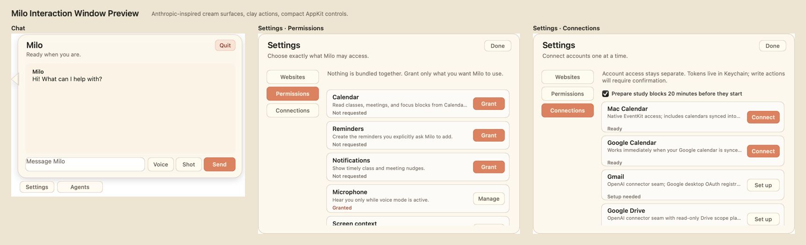

# Stickman

Stickman is an open-source macOS desktop companion: a calm, screen-aware helper while you work and a physics-driven cursor opponent when you choose to spar.

The app is native Swift and AppKit. Its black stick figure is procedurally drawn and animated, so the repository does not bundle character artwork or frames from another production.



## Highlights

- Transparent companion window that follows you across macOS Spaces
- Original skeletal animation system with walking, cross-legged sitting, gestures, and combat poses
- Peaceful mode by default; only a deliberate triple-click starts sparring
- Request-scoped screenshot understanding and optional screen annotations
- Text and realtime voice chat through the OpenAI API
- Persistent background research agents
- Explicit Chrome tab control through macOS Automation
- Calendar summaries, meeting nudges, and optional proactive study preparation
- Permission center with independent grants for sensitive capabilities
- Configurable Canvas tenant with Keychain-backed credentials
- Temporary focus sessions and an optional bedtime browser guard
- Universal app builds for Apple Silicon and Intel Macs

## Requirements

- macOS 12 or newer
- Xcode 16 Command Line Tools or newer (`xcode-select --install`) when building from source
- An OpenAI API key for AI and voice features
- Google Chrome only for Chrome-specific actions; the rest of Stickman works without it

Stickman is currently distributed as a prototype. Release archives are ad-hoc signed unless the maintainer configures Apple Developer ID signing and notarization, so source builds are the smoothest installation path for collaborators.

## Install from source

```bash
git clone https://github.com/chaymore/stickman.git
cd stickman
./stickman --set-api-key
./stickman --install-app
open /Applications/Stickman.app
```

The API key is stored in macOS Keychain, not in the repository. OpenRouter can be used as an optional fallback:

```bash
./stickman --set-openrouter-key
export STICKMAN_AI_PROVIDER=openrouter
export STICKMAN_OPENROUTER_MODEL=google/gemini-2.5-flash
./stickman --open-app
```

## Controls

| Action | Control |
| --- | --- |
| Open chat | Double-click Stickman |
| Start sparring | Triple-click Stickman |
| Walk somewhere | Right-click the destination |
| Show or hide | `Option+B` |
| Quick screen-aware assist | `Option+Space` |
| End sparring | `Option+F`, ask for a truce, or circle Stickman |
| Open chat menu | `Control+-` |
| Start voice mode | Press `Control+Option` together |

After the same foreground window remains active for a minute, Stickman walks to its top-right corner and sits cross-legged. Switching or closing the window makes him stand and roam again.

## Permissions and privacy

Stickman does not request every permission at launch. Use the menu-bar icon’s **Permissions…** screen to grant Calendar, Reminders, notifications, microphone, screen context, Accessibility, or Chrome Automation separately.

- Screenshots are captured only for the current request and are not retained after the response.
- External credentials are stored in macOS Keychain.
- Browser and desktop actions require an explicit request or an enabled focus rule.
- Sparring effects are simulated overlays; Stickman does not damage documents or synthesize clicks.
- Calendar-triggered study preparation can be disabled under **Connections…**.

See [Privacy](docs/PRIVACY.md) for the data-flow summary.

## Connections

- **Calendar:** reads events already available in Calendar.app, including calendars synced through macOS Internet Accounts.
- **Canvas:** enter your school’s Canvas HTTPS address and a personal token. Current calls are read-only and limited to upcoming coursework.
- **BYU Learning Suite:** optional browser shortcut using the user’s existing Chrome session.
- **Notion and Slack:** token storage boundaries are present, but the remote tool runtimes are not reported as connected until their authorization flows are implemented.
- **Gmail and Drive:** require a registered Google desktop OAuth client before account authorization can be completed.

## Development

```bash
make test       # Swift test suite
make build      # universal Stickman.app
make install    # build and copy to /Applications
make package    # versioned zip and SHA-256 checksum
make verify     # secret/path scan, tests, native build, codesign check
```

Useful preview commands:

```bash
./stickman --render-avatar-preview
./stickman --render-avatar-animation-preview
./stickman --render-window-preview
./stickman --check-preview-artifacts
```

Runtime model overrides:

```bash
export STICKMAN_OPENAI_MODEL=gpt-5.6-terra
export STICKMAN_AGENT_MODEL=gpt-5.6-sol
export STICKMAN_REALTIME_MODEL=gpt-realtime-2.1
export STICKMAN_REALTIME_VOICE=marin
```

Read [CONTRIBUTING.md](CONTRIBUTING.md), [Architecture](docs/ARCHITECTURE.md), and [Distribution](docs/DISTRIBUTION.md) before making structural or release changes.

## Upgrading from Milo

The renamed app performs a one-time, non-destructive migration of compatible preferences and files from `~/Library/Application Support/Milo`. Keychain lookups also fall back to the former Milo service names and copy credentials forward when used. The old app and data are not deleted automatically.

## Project status

The interaction and assistant foundations work, but several integrations are intentionally incomplete. OAuth-backed Gmail, Drive, Notion, and Slack tools need provider registrations and production authorization callbacks. A public, warning-free binary also needs an Apple Developer ID certificate and notarization credentials.

## Attribution

Stickman is an independent, unofficial project inspired by desktop pets and the energy of computer-world stick-figure animation. It is not affiliated with or endorsed by Alan Becker or the *Animator vs. Animation* series. No video frames, logos, audio, or character assets from that series are included.

## License

[MIT](LICENSE)
