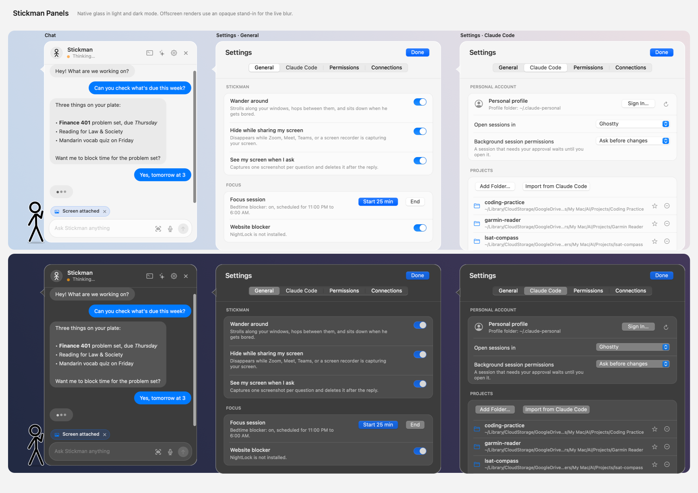

# Stickman

Stickman is an open-source macOS desktop companion: a calm, screen-aware helper while you work and a physics-driven cursor opponent when you choose to spar.

The app is native Swift and AppKit. Its black stick figure is procedurally drawn and animated, so the repository does not bundle character artwork or frames from another production.



## Highlights

- Transparent companion window that follows you across macOS Spaces
- Gravity: he stands on the bottom of the screen and on top of your windows, leaps between them, and rides along when you drag a window
- Skeletal animation with inverse kinematics: foot-planted walking and running, jumps, falls, landings, idle fidgets, and cross-legged sitting
- Pick him up and throw him; he flails on the way down and lands
- Native glass chat and settings panels that follow light and dark mode
- Peaceful mode by default; only a deliberate Option+triple-click starts sparring
- Request-scoped screenshot understanding and optional screen annotations
- Text and realtime voice chat through the OpenAI API
- Persistent background research agents
- Explicit Chrome tab control through macOS Automation
- Calendar summaries, meeting nudges, and optional proactive study preparation
- Permission center with independent grants for sensitive capabilities
- Configurable Canvas tenant with Keychain-backed credentials
- Stickman Blocker: a protected, schedule-based website blocker with a "Blocked by Stickman" page, plus temporary focus sessions and a softer bedtime guard
- Universal app builds for Apple Silicon and Intel Macs

## Requirements

- macOS 13 or newer
- Xcode 16 Command Line Tools or newer (`xcode-select --install`) when building from source
- An OpenAI API key for AI and voice features
- Google Chrome only for Chrome-specific actions; the rest of Stickman works without it

Stickman is currently distributed as a prototype. Release archives are ad-hoc signed unless the maintainer configures Apple Developer ID signing and notarization, so source builds are the smoothest installation path for collaborators.

## Install from source

```bash
git clone https://github.com/chaymore/stickman.git
cd stickman
./stickman --set-api-key
./stickman --install-app
open /Applications/Stickman.app
```

The API key is stored in macOS Keychain, not in the repository. OpenRouter can be used as an optional fallback:

```bash
./stickman --set-openrouter-key
export STICKMAN_AI_PROVIDER=openrouter
export STICKMAN_OPENROUTER_MODEL=google/gemini-2.5-flash
./stickman --open-app
```

## Controls

| Action | Control |
| --- | --- |
| Open chat | Double-click Stickman |
| Poke | Click Stickman once |
| Pick up and throw | Drag Stickman, then let go mid-motion |
| Start sparring | `Option`+triple-click Stickman |
| Send him somewhere | `Option`+right-click a window to climb onto it, or empty space to walk there |
| Close the panel | `Esc` |
| Hide in the notch, or bring him back out | `Option+B` |
| Quick screen-aware assist | `Option+Space` |
| End sparring | `Option+F`, **Stop Fighting** in the menu bar, or circle Stickman with the cursor |
| Open chat menu | `Control+-` |
| Start voice mode | Press `Control+Option` together |

After the same foreground window stays active for a minute, Stickman walks or leaps to its top-right corner and sits cross-legged. Switching windows makes him stand up and stretch his legs. If a window he stands on closes or gets covered, he falls to the next ledge below.

Left alone, he strolls along his ledge, hops between windows, and fidgets. After a few quiet minutes he sits down, then falls asleep. Turn off wandering in **Settings → General**.

When Zoom, Meet, Teams, or a screen recorder starts capturing your screen, Stickman and his panel fade out. They come back a couple of seconds after the capture stops. Choose **Show Stickman Anyway** from the menu bar to keep him visible for the rest of that share, or turn the behavior off in **Settings → General**. macOS has no public API for this, so Stickman reads the window server's capture flag (the one behind the purple recording icon) through a private CoreGraphics call. It reads only whether a capture is running, never what is captured. If a future macOS removes the call, the setting turns itself off.

## Stickman Blocker

Stickman Blocker is the protected website blocker that used to be NightLock. A root helper enforces it through `/etc/hosts`, so quitting the app doesn't lift it, and changing the schedule takes the recovery key you generated at install. Blocked tabs land on a "Blocked by Stickman" page where he squares up and throws a jab.

Install it from Stickman's menu bar menu (**Install Blocker Helper…**) or with `./stickman --install-blocker`. Once it's installed, Stickman starts at login and has no Quit command; press `Option+B` to tuck him into the notch instead. See [Blocker/README.md](Blocker/README.md) and [Blocker recovery](docs/BLOCKER_RECOVERY.md).

## Claude Code

Stickman can hand coding work to Claude Code and tap you when it's done. It runs Claude Code under its own profile folder (`~/.claude-personal` by default), so it can use a different account from the one your terminal and the Claude desktop app use.

**Set up once**

1. Open **Settings → Claude Code** and choose **Sign In…**. A terminal opens and signs that profile in through your browser. Pick your personal account. You can also run `CLAUDE_CONFIG_DIR="$HOME/.claude-personal" claude auth login` yourself.
2. Add your project folders on the same tab. Star one to make it the default.
3. For cloud sessions, connect GitHub to the same claude.ai account (run `/web-setup` inside a session on that profile, or connect it at claude.ai/code).

**Use it**

| Do this | Type or say |
| --- | --- |
| Start a background session | `/claude @project fix the failing test`, or "have Claude fix the failing test in project" |
| Run it in the cloud instead | `/cloud @project write tests for the parser`, or add "in the cloud" |
| Have Claude use your apps | `/computer add my 3pm dentist appointment to Calendar`, or "use my computer to…" |
| See sessions | Click the terminal icon in the chat header, type `/sessions`, or pick **Claude Code Sessions** from the menu bar |

Without a project name, Stickman uses the project named in the window you're looking at, then your default project. Background sessions run with the permission level you pick in settings. A session that needs approval waits, Stickman waves at you, and **Open** attaches it in Ghostty or Terminal. When a session finishes, he hops and posts a notification.

**Computer use.** `/computer` and "use my computer to…" start a background session on Opus with Stickman's computer-use tools: `list_apps`, `open_app`, `get_app_state`, `click`, `type_text`, `press_key`, `scroll`, `set_value`, `perform_action`, and `drag`. Claude reads each app through its accessibility outline plus a screenshot of its front window, acts on numbered controls, and gets the updated state back after every action. The tools come from `stickman-computer-use`, an MCP server inside the app bundle that relays each call to the running app over a private socket, so the work happens under Stickman's own permissions.

- Turn on **Accessibility** and **Screen Recording** for Stickman (Settings → Claude Code shows both). Ad-hoc signed builds change identity on every rebuild, so after reinstalling you may need to remove Stickman from both lists and add it again.
- Claude asks before it touches each new app: **Always Allow**, **Allow Once**, or **Don't Allow**. Terminals, password managers, Keychain Access, System Settings, and Stickman itself are off-limits, and password fields are never typed into.
- While Claude works, a banner at the top of the screen says which app it's using. Press **esc** to stop it.
- Claude Code only starts background sessions in folders your personal profile trusts. The first time you use a project, Stickman opens a terminal there: accept the trust prompt, type `/exit`, and ask again.

Stickman checks the profile's sign-in only when you open the Claude Code tab or press refresh. Claude Code has an open bug where frequent sign-in checks can expire a profile's login ([claude-code#95822](https://github.com/anthropics/claude-code/issues/95822)). If a session reports "Login expired", sign in again from the same tab.

## Permissions and privacy

Stickman does not request every permission at launch. Use the menu-bar icon’s **Permissions…** screen to grant Calendar, Reminders, notifications, microphone, screen context, Accessibility, or Chrome Automation separately.

- Screenshots are captured only for the current request and are not retained after the response.
- External credentials are stored in macOS Keychain.
- Browser and desktop actions require an explicit request or an enabled focus rule.
- Sparring effects are simulated overlays; Stickman does not damage documents or synthesize clicks.
- Calendar-triggered study preparation can be disabled under **Connections…**.

See [Privacy](docs/PRIVACY.md) for the data-flow summary.

## Connections

- **Calendar:** reads events already available in Calendar.app, including calendars synced through macOS Internet Accounts.
- **Canvas:** enter your school’s Canvas HTTPS address and a personal token. Current calls are read-only and limited to upcoming coursework.
- **BYU Learning Suite:** optional browser shortcut using the user’s existing Chrome session.
- **Notion and Slack:** token storage boundaries are present, but the remote tool runtimes are not reported as connected until their authorization flows are implemented.
- **Gmail and Drive:** require a registered Google desktop OAuth client before account authorization can be completed.

## Development

```bash
make test       # Swift test suite
make build      # universal Stickman.app
make install    # build and copy to /Applications
make package    # versioned zip and SHA-256 checksum
make verify     # secret/path scan, tests, native build, codesign check
```

Useful preview commands:

```bash
./stickman --render-avatar-preview
./stickman --render-avatar-animation-preview
./stickman --render-window-preview
./stickman --check-preview-artifacts
```

Runtime model overrides:

```bash
export STICKMAN_OPENAI_MODEL=gpt-5.6-terra
export STICKMAN_AGENT_MODEL=gpt-5.6-sol
export STICKMAN_REALTIME_MODEL=gpt-realtime-2.1
export STICKMAN_REALTIME_VOICE=marin
```

Read [CONTRIBUTING.md](CONTRIBUTING.md), [Architecture](docs/ARCHITECTURE.md), and [Distribution](docs/DISTRIBUTION.md) before making structural or release changes.

## Upgrading from Milo

The renamed app performs a one-time, non-destructive migration of compatible preferences and files from `~/Library/Application Support/Milo`. Keychain lookups also fall back to the former Milo service names and copy credentials forward when used. The old app and data are not deleted automatically.

## Project status

The interaction and assistant foundations work, but several integrations are intentionally incomplete. OAuth-backed Gmail, Drive, Notion, and Slack tools need provider registrations and production authorization callbacks. A public, warning-free binary also needs an Apple Developer ID certificate and notarization credentials.

## Attribution

Stickman is an independent, unofficial project inspired by desktop pets and the energy of computer-world stick-figure animation. It is not affiliated with or endorsed by Alan Becker or the *Animator vs. Animation* series. No video frames, logos, audio, or character assets from that series are included.

## License

[MIT](LICENSE)
